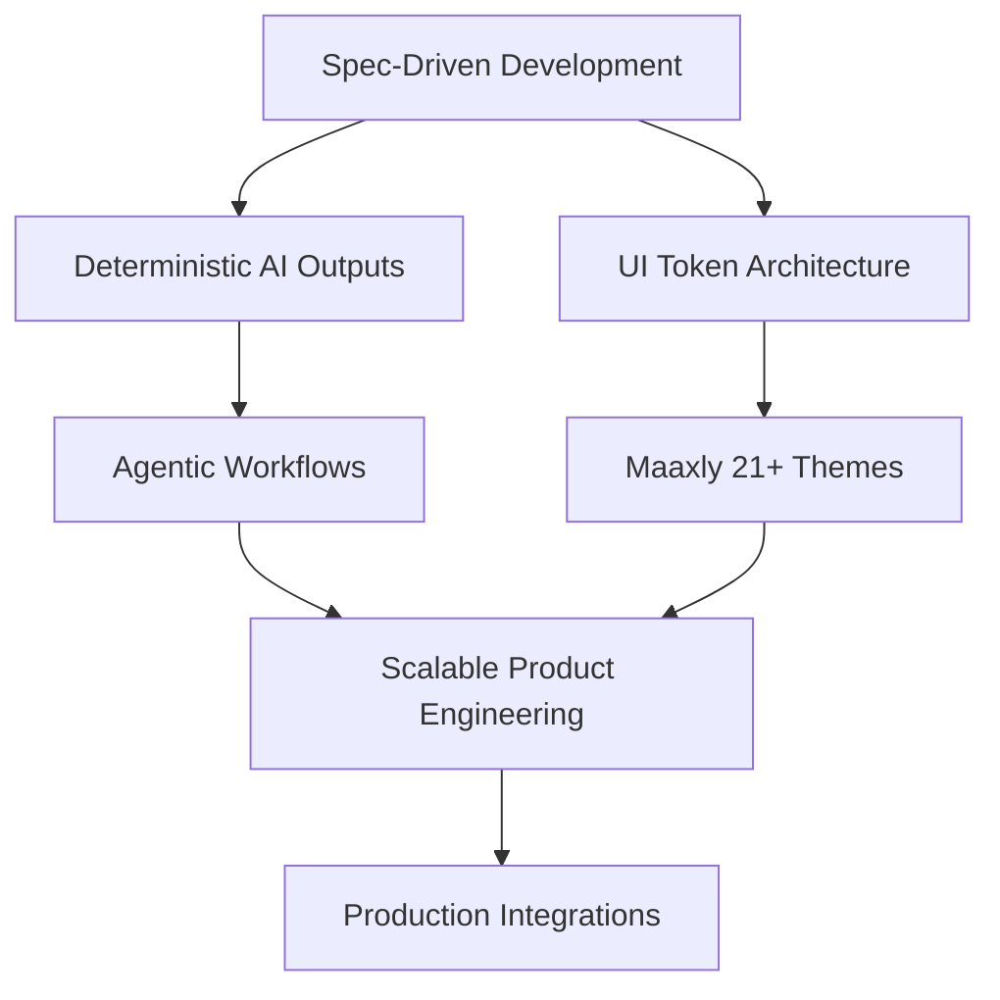

  

  <h3>B.E. CSE Graduate (Class of 2025) @ St. Joseph's Institute of Technology</h3>
  
<em>Architecting scalable Agentic Systems, SDD workflows, and cloud-native solutions.</em>

  
  
  

---

## Current Focus and Engineering Evolution

Since graduating in 2025, my work has evolved from general full-stack development into Agentic Workflows, UI Engineering, and Spec-Driven Development (SDD). I now prioritize deterministic AI pipelines, reusable architecture, and production-minded delivery.

### AI and Agentic Systems
- Built early local "Agent Skills" style orchestration before native workflow tooling became mainstream.
- Applied SDD to enforce structured AI outputs and reduce prompt drift in multi-repo development.
- Developed a Sybil Attack Detection system for VANETs using Transformer + CNN, reaching 96% accuracy on the VereMi dataset.

### UI Engineering and Systems
- Designed and scaled the Maaxly styling architecture with 21+ thematic flavors using tokenized design foundations.
- Ran practical R&D on DaisyUI and TweakCN/Shadcn patterns for modular, maintainable UI systems.
- Improved development flow in Polymath and Plane by shifting debugging cycles into spec refinement.

### Cloud and Core Engineering
- AWS Restart Graduate and actively preparing for AWS CLF-C02.
- Continuous improvement in data structures, system design, and production engineering habits.

---

## Tech Stack

<table align="center">
  <tr>
    <td align="center"><strong>Frontend and UI</strong></td>
    <td align="center"><strong>Backend and Database</strong></td>
    <td align="center"><strong>AI, Agents and Cloud</strong></td>
  </tr>
  <tr>
    <td align="center">
      
    </td>
    <td align="center">
      
    </td>
    <td align="center">
      
    </td>
  </tr>
</table>

---

## Featured Projects

| Project | Stack | Highlights | Status |
|------|------|-----------|--------|
| Agentic Skills and SDD Workflow | Python, Markdown, JSON | Deterministic AI orchestration with reusable instruction systems | Live |
| Maaxly UI Architecture | React, Tailwind, Design Tokens | 21+ theme flavors and scalable style infrastructure | Completed |
| Sybil Attack Detector (VANET) | PyTorch, Transformer, CNN | 96% accuracy on VereMi dataset | Completed |
| Polymath and Plane UI Revamps | TypeScript, React, Node.js | Spec-driven refactors and workflow stabilization | Ongoing |

---

## Engineering Graph

---

## GitHub Analytics

  
  

 

  
  

---

## Workstation

  
<strong>My Hardware Setup</strong>

   
  <ul>
    <li><strong>Laptop:</strong> Dell G15 5520 (2022)</li>
    <li><strong>RAM:</strong> 16GB</li>
    <li><strong>OS:</strong> Windows 11 + Linux</li>
  </ul>

---

  <h2>Open to Opportunities</h2>
  
<strong>Software Engineer | AI Engineer | Agentic Workflow Builder</strong> 
  Chennai • Bangalore • Hyderabad

  

~~~
